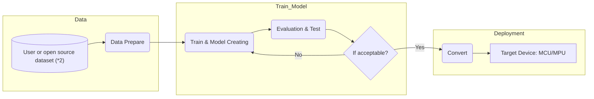

# NuEdgeWise
The Tiny ML Tool provides a platform for training and deployment using TensorFlow Lite on Nuvoton's MCU/MPU. 
---
- The NuEdgeWise tools offer Jupyter Notebooks with a user-friendly interface, simplifying the process of working with Tiny ML.
- Please follow [second](#2-installation--env-create) & [third](#3-choose-your-use-caseapplication) steps to install the Python environment once and explore all the ML tools/examples provided below. 

## 1. Tool Table
| Tool | Use Case | Model | Description |M467|MA35D1|
| :-- | :-- | :--| :--|:--|:--|
| [ML_KWS](https://github.com/OpenNuvoton/ML_KWS)  | Keyword Spotting | DNN/DS-CNN | Small vocabulary(<=1s) keyword spotting. | :heavy_check_mark: | |
| [ML_G-Sensor](https://github.com/OpenNuvoton/ML_G-Sensor) | Gesture Recognition Magic Wand  | CNN| The data consists of 3-dimensional accelerometer readings captured during various gestures. In this Tool, we provide functionality for data collection.|:heavy_check_mark:| |
| [ML_Image_Classification](https://github.com/OpenNuvoton/ML_Image_Classification) | Image Classification | MobileNet | We utilize transfer learning and fine-tuning techniques, where the pre-trained model is MobileNet trained on the ImageNet dataset. Users have the flexibility to train the model further with their own data.| |:heavy_check_mark: |
| [ML_Object_Detection](https://github.com/OpenNuvoton/ML_Object_Detection) | Object Detection | SSD_MobileNet_fpnlite v2/v3| We utilize the TensorFlow Object Detection API, which supports various models. For our MPU's edge use-case, we opt for a smaller model. If users wish to experiment with SSD_MobileNet_fpnlite_v3, please use the TF1 environment. More details regarding the TF1 environment can be found in the provided link.| |:heavy_check_mark: |
| [ML_YOLO](https://github.com/OpenNuvoton/ML_YOLO) | Object Detection | Yolo-fastest v1| We use DarkNet training with a highly compact YOLO model. This tool provides features for converting the model to TensorFlow Lite format and optimizing it using Vela.| |:heavy_check_mark: |
| [ML_Gearbox_Fault_Diagnosis](https://github.com/OpenNuvoton/ML_Gearbox_Fault_Diagnosis) |Anomaly Detection | DNN/Autoencoder | A basic practice for Tiny ML includes training a model, converting it to TFLite format, and deploying it on an EVK.|:heavy_check_mark: | |
| [ML_VWW](https://github.com/OpenNuvoton/ML_VWW) | Visual Wake Words | Small MobileNet RGB/gray | In the microcontroller vision use-case, the objective is to identify whether a person (or any other object of interest) is present in an image. |:heavy_check_mark: | |  

## 2. Installation & Env Create
### A. Install Anaconda
- Please download and install [Anaconda](https://www.anaconda.com/download) .
- If you are already familiar with Python and virtual environments, you can skip this step. However, please make sure to use JupyterLab or Jupyter Notebook as your environment.
### B. Create [NuEdgeWise](https://github.com/MaxCYCHEN/NuEdgeWise) virtual environment
- Open JupyterLab by clicking on the icon. 
- Then, open the "create_env.ipynb" notebook and follow the provided instructions. 
- Almost all the required Python packages are already installed in this Anaconda environment. However, for ML_Object_Detection, additional installation steps are required. It is recommended to follow the installation steps provided in the [ML_Object_Detection](https://github.com/OpenNuvoton/ML_Object_Detection) repository.

## 3. Choose your use case/application
- Download the directory from the table above and open Anaconda, selecting the NuEdgeWise environment.
- Please refer to the readme in the [Tools](#1-tool-table) section for instructions on how to use it.
- Now you can start running the Tiny-ML examples from the Jupyter notebook in each [Tools](#1-tool-table).
## 4. Description
- Fig1: The general workflow of our tiny ML tools.

- All of these tools can be used to train with custom datasets and convert them to deployment-ready formats such as TFLite or TFLite for Microcontrollers.
- (*2) [ML_KWS](https://github.com/OpenNuvoton/ML_KWS) and [ML_G-Sensor](https://github.com/OpenNuvoton/ML_G-Sensor) are able to collect data by Nuvoton EVK board.
- [ML_Image_Classification](https://github.com/OpenNuvoton/ML_Image_Classification), [ML_VWW](https://github.com/OpenNuvoton/ML_VWW) and [ML_YOLO](https://github.com/OpenNuvoton/ML_YOLO) also support the Vela compiler for MCU+NPU use-cases. Other tools/models can also be applied to Vela using the [ML_YOLO](https://github.com/OpenNuvoton/ML_YOLO) `vela/` directory as a reference.
- In each tool/use-case, we also provide example inference code for Nuvoton MCU/MPU devices. 
