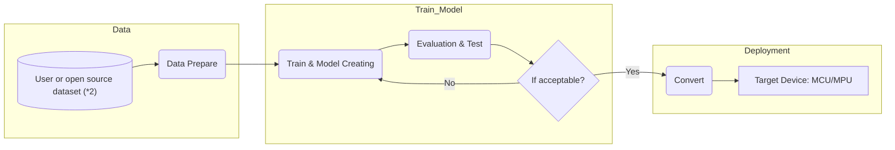

# NuEdgeWise
Tiny ML Tool for training and deployment with TF Lite on Nuvoton's MCU/MPU. 
---
- These NuEdgeWise tools offer Jupyter notebooks with friendly UI to work with tiny-ML easily.
- Follow [second](#2-installation--env-create) & [third](#3-choose-your-use-caseapplication) points to install the python env once and play with all below ML Tool/example. 

## 1. Tool Table

| Tool | Use Case | Model | Description |M467|MA35D1|
| :-- | :-- | :--| :--|:--|:--|
| [ML_nuKws](https://github.com/OpenNuvoton/ML_nuKws)  | Keyword Spotting | DNN/DS-CNN | Small vocabulary(<=1s) keyword spotting. |  |:heavy_check_mark: |
| [ML_G-sensor](https://github.com/OpenNuvoton/ML_G-sensor) | Gesture Recognition Magic Wand  | CNN| Data is 3-dims accelerometer of different gesture, and we provide data collecting in this Tool.|:heavy_check_mark:| |
| [ML_tf2_image_classfication_nu](https://github.com/OpenNuvoton/ML_tf2_image_classfication_nu) | Image Classification | MobileNet | Use Transfer learning & fine tune, and the pre-train model is MobileNet with imageNet data. User can train with their own data.| |:heavy_check_mark: |
| [ML_tf2_object_detection_nu](https://github.com/OpenNuvoton/ML_tf2_object_detection_nu) | Object Detection | SSD_MobileNet_fpnlite v2/v3| Use TF objection detection API and it also supports many other models. We choose the tinier model for MPU's edge use-case. If user wants to try SSD_MobileNet_fpnlite_v3, please use TF1 env which detail is in the link.| |:heavy_check_mark: |
| [ML_yolo](https://github.com/OpenNuvoton/ML_yolo) | Object Detection | Yolo-fastest v1| Use DarkNet training with very tiny Yolo model. This tool including converting to TFlite & Vela source file.| |:heavy_check_mark: |
| [ML_Gearbox_Fault_Diagnosis](https://github.com/OpenNuvoton/ML_Gearbox_Fault_Diagnosis) |Anomaly Detection | DNN/Autoencoder | A basic practice for Tiny ML which including training a model, converting to tflite and deploy on EVK board.|:heavy_check_mark: | |
| [VWW](https://github.com/OpenNuvoton/ML_tf2_image_classfication_nu) | Visual Wake Words | Small MobileNet rgb/gray | Microcontroller vision use-case of identifying whether a person (we can change to other object) is present in the image or not. |:heavy_check_mark: | |  

## 2. Installation & Env Create
### A. Install Anaconda
- Download the [Anaconda](https://www.anaconda.com/download) and install it.
- If you are familiar with python and virtual environment, you can skip this. However please use JupyterLab or Jupyter notebook.
### B. Create this [NuEdgeWise](https://github.com/MaxCYCHEN/NuEdgeWise) virtual environment
- Open JupyterLab from the icon. 
- Open the `create_env.ipynb` and follow the easy instructions. 
- Almost all needed python packages are installed in this anaconda-env. In addition to [ML_tf2_object_detection_nu](https://github.com/OpenNuvoton/ML_tf2_object_detection_nu) needs further installation steps. (Recommend to install this as followed.)

## 3. Choose your use case/application
### A. Usage
- Download the directory from the above table and open Anaconda choosing the `NuEdgeWise`.
- Please check the readme in [Tools](#1-tool-table) for understanding how to use it. 
- Now you can start the tiny-ml example from Jupyter-notebook.
## 4. Description
- Fig1: The general workflow of our tiny ML tools.

- All these Tools are able to train with custom dataset and convert to deployment style(TFlite/TFlite for Microcontrollers).
- (*2) [ML_nuKws](https://github.com/OpenNuvoton/ML_nuKws) and [ML_G-sensor](https://github.com/OpenNuvoton/ML_G-sensor) are able to collect data by nuvoTon EVK board.
- [ML_tf2_image_classfication_nu](https://github.com/OpenNuvoton/ML_tf2_image_classfication_nu) and [ML_yolo](https://github.com/OpenNuvoton/ML_yolo) are also support vela compiler for MCU+NPU use-case. Other Tools/models are able to convert to vela too by reference [ML_yolo](https://github.com/OpenNuvoton/ML_yolo) `vela/`.
- In each Tool/use-case, we also support example inference code on nuvoTon MCU/MPU devices. 
