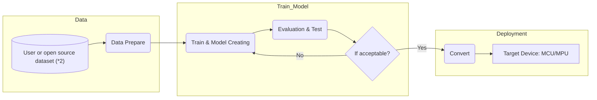

# NuEdgeWise
The Tiny ML Tool provides a platform for training and deployment using TensorFlow Lite on Nuvoton's MCU/MPU. 
---
- The NuEdgeWise tools offer Jupyter Notebooks with a user-friendly interface, simplifying the process of working with Tiny ML.
- Please follow [second](#2-installation--env-create) & [third](#3-choose-your-use-caseapplication) steps to install the Python environment once and explore all the ML tools/examples provided below.
- We utilize TensorFlow Lite for Microcontrollers as the inference framework for Nuvoton MCU, and currently, the NuEdgeWise tools provide TensorFlow Lite (TFLite) and TFLite Vela models.
- Regarding the PyTorch model, please review the [fifth](#5-PyTorch-to-Tflite) step to assist you in converting the PyTorch model to a (TFLite) model.

## 1. Tool Table
| Tool | Use Case | Model | M55M1 |M467|MA35D1|Description |
| :-- | :-- | :--| :--|:--|:--|:--|
| [ML_KWS](https://github.com/OpenNuvoton/ML_KWS)  | Keyword Spotting | DNN/DS-CNN | :heavy_check_mark: |:heavy_check_mark:|:small_blue_diamond:| Keyword spotting with a small vocabulary (<=1s). |
| [ML_G-Sensor](https://github.com/OpenNuvoton/ML_G-Sensor) | Gesture Recognition Magic Wand  | CNN| :small_blue_diamond:| :heavy_check_mark:|:small_blue_diamond:|The data consists of 3-dimensional accelerometer readings captured during various gestures. In this Tool, we provide functionality for data collection.|
| [ML_Image_Classification](https://github.com/OpenNuvoton/ML_Image_Classification) | Image Classification | MobileNet/efficientnet/fdmobilenet/shufflenet | :heavy_check_mark:|:small_blue_diamond: (shufflenet) |:small_blue_diamond:|We utilize transfer learning and fine-tuning techniques, where the pre-trained model is MobileNet trained on the ImageNet dataset. Users have the flexibility to train the model further with their own data.|
| [ML_Object_Detection](https://github.com/OpenNuvoton/ML_Object_Detection) | Object Detection | SSD_MobileNet_fpnlite v2/v3|:heavy_check_mark: |:x:|:heavy_check_mark:|We utilize the TensorFlow Object Detection API, which supports various models. For our MPU's edge use-case, we opt for a smaller model. If users wish to experiment with SSD_MobileNet_fpnlite_v3, please use the TF1 environment. More details regarding the TF1 environment can be found in the provided link.|
| [ML_YOLO](https://github.com/OpenNuvoton/ML_YOLO) | Object Detection | Yolo-fastest v1| :heavy_check_mark: |:x:|:heavy_check_mark:|We use DarkNet training with a highly compact YOLO model. This tool provides features for converting the model to TensorFlow Lite format and optimizing it using Vela.|
| [ML_Gearbox_Fault_Diagnosis](https://github.com/OpenNuvoton/ML_Gearbox_Fault_Diagnosis) |Anomaly Detection | DNN/Autoencoder | :small_blue_diamond:|:heavy_check_mark:|:small_blue_diamond:|A basic practice for Tiny ML includes training a model, converting it to TFLite format, and deploying it on an EVK.|
| [ML_VWW](https://github.com/OpenNuvoton/ML_VWW) | Visual Wake Words | Small MobileNet RGB/gray | :heavy_check_mark:|:heavy_check_mark:|:small_blue_diamond:|In the microcontroller vision use-case, the objective is to identify whether a person (or any other object of interest) is present in an image. |

- :heavy_check_mark: : The model is ready to run on the device, and we provide example board inference code.
- :small_blue_diamond: : The model is ready to run on the device, and users need to develop their own inference code.
- :x: : The model cannot currently run on the device.
## 2. Installation & Env Create
### A. Create a Python Environment
- If you are already familiar with Python and virtual environments, you can skip this step. Please be reminded that NuEdgeWise uses Python 3.8.
- We recommand to use [Miniforge](https://github.com/conda-forge/miniforge), and please download the Miniforge3 basing on your OS.
- Execute the installation steps for Miniforge3.exe. 
### B. Create [NuEdgeWise](https://github.com/OpenNuvoton/NuEdgeWise) Virtual Environment
- (A.) Open miniforge. 
- (B.) Execute `conda create --name NuEdgeWise_env  python=3.8.13` to create new python environment.
- (C.) Execute `conda activate NuEdgeWise_env` to open NuEdgeWise_env environment.
- (D.) Go to this [NuEdgeWise](https://github.com/OpenNuvoton/NuEdgeWise) folder(From git clone or download it directly) and Execute `python -m pip install -r requirements.txt`.
- For Windows users, we provide a batch file to execute these commands all at once.
- Almost all the required Python packages are already installed in this Conda environment. However, for ML_Object_Detection, additional installation steps are required. It is recommended to follow the installation steps provided in the [ML_Object_Detection](https://github.com/OpenNuvoton/ML_Object_Detection) repository.

### C. Alternatively, Docker CPU version
- (A.) Download [ML_KWS](https://github.com/OpenNuvoton/ML_KWS), [ML_Image_Classification](https://github.com/OpenNuvoton/ML_Image_Classification) same location as `NuEdgeWise/`
- (B.) In `NuEdgeWise/`
- (C.) Build image: `docker build -t nuedgewise:v1 .`
- (D.) Run container: `docker compose run nuedgewise`

## 3. Choose your use case/application
- Download the directory from the table above and open Miniforge or your python environment, selecting the NuEdgeWise environment.
- Please refer to the readme in the [Tools](#1-tool-table) section for instructions on how to use it.
- Now you can start running the Tiny-ML examples from the Jupyter notebook in each [Tools](#1-tool-table).
- In each tool/use-case, we also provide example inference code for Nuvoton MCU/MPU devices. 
## 4. Description
- Fig1: The general workflow of our tiny ML tools.

- All of these tools can be used to train with custom datasets and convert them to deployment-ready formats such as TFLite or TFLite for Microcontrollers.
- (*2) [ML_KWS](https://github.com/OpenNuvoton/ML_KWS) and [ML_G-Sensor](https://github.com/OpenNuvoton/ML_G-Sensor) are able to collect data by Nuvoton EVK board.
- [ML_Image_Classification](https://github.com/OpenNuvoton/ML_Image_Classification), [ML_VWW](https://github.com/OpenNuvoton/ML_VWW) and [ML_YOLO](https://github.com/OpenNuvoton/ML_YOLO) also support the Vela compiler for MCU+NPU use-cases. Other tools/models can also be applied to Vela using the [ML_YOLO](https://github.com/OpenNuvoton/ML_YOLO) `vela/` directory as a reference.


## 5. PyTorch to Tflite
- The converting step is PyTorch => ONNX => Tflite.
- (A.) PyTorch provides a built-in feature for exporting the model to ONNX format: https://pytorch.org/tutorials/beginner/onnx/export_simple_model_to_onnx_tutorial.html
- (B.) To convert ONNX to TFLite, please refer to [PINTO0309/onnx2tf](https://github.com/PINTO0309/onnx2tf). Follow the installation step provided, and for Nuvoton products, you may utilize the following commands exclusively
```
# INT8 Quantization, Full INT8 Quantization
# INT8 Quantization with INT16 activation, Full INT8 Quantization with INT16 activation,
# Dynamic Range Quantization

# INT8 Quantization (per-channel)
onnx2tf -i emotion-ferplus-8.onnx -oiqt
# INT8 Quantization (per-tensor)
onnx2tf -i emotion-ferplus-8.onnx -oiqt -qt per-tensor
```
