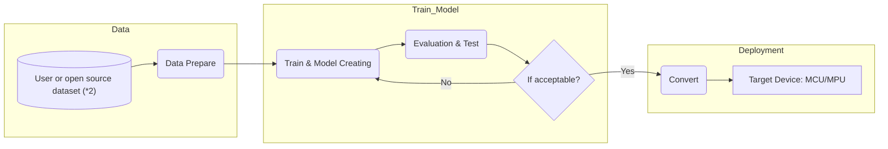

# NuEdgeWise
Tiny ML Tool for training and deployment with TF Lite on Nuvoton's MCU/MPU. 
---
- The NuEdgeWise tools provide Jupyter notebooks with a user-friendly interface, making it easy to work with tiny-ML.
- Follow [second](#2-installation--env-create) & [third](#3-choose-your-use-caseapplication) to install the Python environment once and explore all the ML tools/examples provided below.. 

## 1. Tool Table

| Tool | Use Case | Model | Description |M467|MA35D1|
| :-- | :-- | :--| :--|:--|:--|
| [ML_KWS](https://github.com/OpenNuvoton/ML_KWS)  | Keyword Spotting | DNN/DS-CNN | Small vocabulary(<=1s) keyword spotting. |  |:heavy_check_mark: |
| [ML_G-Sensor](https://github.com/OpenNuvoton/ML_G-Sensor) | Gesture Recognition Magic Wand  | CNN| Data is 3-dims accelerometer of different gesture, and we provide data collecting in this Tool.|:heavy_check_mark:| |
| [ML_Image_Classification](https://github.com/OpenNuvoton/ML_Image_Classification) | Image Classification | MobileNet | Use Transfer learning & fine tune, and the pre-train model is MobileNet with imageNet data. User can train with their own data.| |:heavy_check_mark: |
| [ML_Object_Detection](https://github.com/OpenNuvoton/ML_Object_Detection) | Object Detection | SSD_MobileNet_fpnlite v2/v3| Use TF objection detection API and it also supports many other models. We choose the tinier model for MPU's edge use-case. If user wants to try SSD_MobileNet_fpnlite_v3, please use TF1 env which detail is in the link.| |:heavy_check_mark: |
| [ML_YOLO](https://github.com/OpenNuvoton/ML_YOLO) | Object Detection | Yolo-fastest v1| Use DarkNet training with very tiny Yolo model. This tool including converting to TFlite & Vela source file.| |:heavy_check_mark: |
| [ML_Gearbox_Fault_Diagnosis](https://github.com/OpenNuvoton/ML_Gearbox_Fault_Diagnosis) |Anomaly Detection | DNN/Autoencoder | A basic practice for Tiny ML which including training a model, converting to tflite and deploy on EVK board.|:heavy_check_mark: | |
| [ML_VWW](https://github.com/OpenNuvoton/ML_VWW) | Visual Wake Words | Small MobileNet rgb/gray | Microcontroller vision use-case of identifying whether a person (we can change to other object) is present in the image or not. |:heavy_check_mark: | |  

## 2. Installation & Env Create
### A. Install Anaconda
- Download the [Anaconda](https://www.anaconda.com/download) and install it.
- If you are familiar with python and virtual environment, you can skip this. However please use JupyterLab or Jupyter notebook.
### B. Create this [NuEdgeWise](https://github.com/MaxCYCHEN/NuEdgeWise) virtual environment
- Open JupyterLab from the icon. 
- Open the `create_env.ipynb` and follow the easy instructions. 
- Almost all the required Python packages are already installed in this Anaconda environment. However, for ML_Object_Detection, additional installation steps are required. It is recommended to follow the installation steps provided in the [ML_Object_Detection](https://github.com/OpenNuvoton/ML_Object_Detection) repository.

## 3. Choose your use case/application
### A. Usage
- Download the directory from the table above and open Anaconda, selecting the NuEdgeWise environment.
- Please refer to the readme in the [Tools](#1-tool-table) section for instructions on how to use it.
- Now you can begin running the Tiny-ML examples from the Jupyter notebook in each [Tools](#1-tool-table).
## 4. Description
- Fig1: The general workflow of our tiny ML tools.

- All of these tools can be used to train with custom datasets and convert them to deployment-ready formats such as TFLite or TFLite for Microcontrollers.
- (*2) [ML_KWS](https://github.com/OpenNuvoton/ML_KWS) and [ML_G-Sensor](https://github.com/OpenNuvoton/ML_G-Sensor) are able to collect data by nuvoTon EVK board.
- [ML_Image_Classification](https://github.com/OpenNuvoton/ML_Image_Classification), [ML_VWW](https://github.com/OpenNuvoton/ML_VWW) and [ML_YOLO](https://github.com/OpenNuvoton/ML_YOLO) also support the Vela compiler for MCU+NPU use-cases. Other tools/models can also be converted to Vela using the [ML_YOLO](https://github.com/OpenNuvoton/ML_YOLO) `vela/` directory as a reference.
- In each tool/use-case, we also provide example inference code for NuvoTon MCU/MPU devices. 
